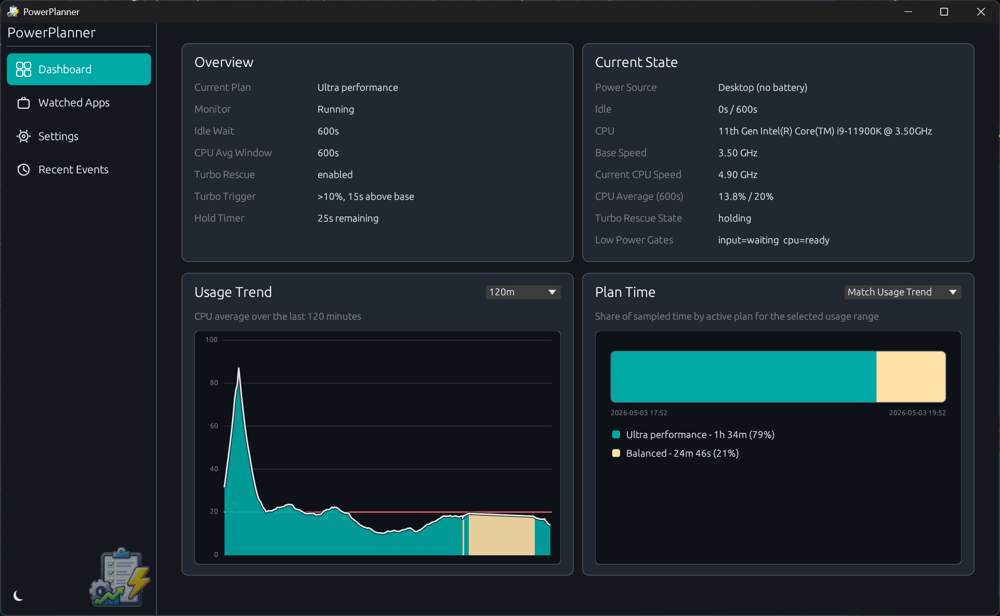

# PowerPlanner

## What Is It

A bit of unnecessary microtuning, probably.  It originated out of a PowerShell script I created when I noticed my CPU was always in turbo mode.  Notepad does not need 5.0GHz+ nor does the room require that much heat during the summer.

This is caused by a Windows 11 "feature" that checks your power plan and if your maximum CPU is set to 100%, that means "always in turbo mode" for Intel CPUs (unsure on AMDs, but probably).

The goal was a way to whitelist certain processes to dynamically elevate my plan to high performance when I needed it--msbuild, older games, etc.--and drop it back down for low CPU tasks.  That PowerShell script has mutated into a "I wonder how Rust works..." project.

So far, Rust works well!  I do admit to laughing at the `ok_or_else` and other somewhat snarky and threatening methods Rust has.

## Can I use this?

Yep, go for it.  Drag it down, ensure you have [Rust](https://rustup.rs/) and [Visual Studio's VC++](https://learn.microsoft.com/en-us/cpp/windows/latest-supported-vc-redist?view=msvc-170) and you should be good with `cargo build --release`

## Are you maintaining this?

As needed for personal use.

## Do you accept PRs?

TBD!